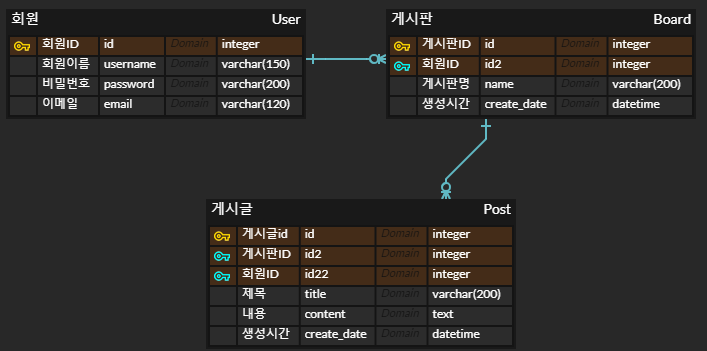
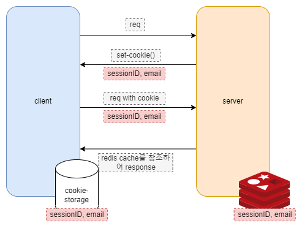

# Flask, Redis Practice


## Environment

- OS
  - windows
- python --version
  - python 3.7
- in-memory cache
  - redis
  - on local host
    - redis 설치 : https://github.com/microsoftarchive/redis/releases
- DB
  - sqlite
  - **should move to postgresql**
- run on localhost

## File Structure

```
├── my_forum/
│      ├─ __init__.py
│      ├─ forms.py
│      ├─ models.py
│      ├─ validation.py
│      └─ views/
│          ├─ board_article_views.py
│          ├─ board_views.py
│          ├─ dashboard_views.py
│          └─ user_views.py
├── .flaskenv
├── .gitignore
├── config.py
├── README.md
└── requirements.txt
```


## Prerequisite

- Make a virtual environment

  ```shell
  $ cd flask_redis_practice
  $ python3 -m venv myvenv
  ```

- Run a virtual environment

  ```shell
  (myvenv) ~/flask_redis_practice $ source myvenv/Scripts/activate
  ```

- Install requirements

  - install requirements

    ```shell
    (myvenv) ~$ pip install -r requirements.txt
    ```

  - pip upgrade

    ```shell
    (myvenv) ~$ python3 -m pip install --upgrade pip
    ```


## Usage

```shell
(myvenv) ~/flask_redis_practice $ set FLASK_APP=my_forum
```

```shell
(myvenv) ~/flask_redis_practice $ set FLASK_ENV=development
```

```shell
(myvenv) ~/flask_redis_practice $ flask run
```

## Database managing

- 모델을 새로 생성하거나 변경할 때 사용
  - 실행하면 **작업 파일이 생성**된다.

```shell
(myvenv) ~/flask_redis_practice $ flask db migrate
```

- 모델의 변경 내용을 실제 데이터베이스에 적용할 때 사용
  - 위에서 생성된 작업 파일을 실행하여 **데이터베이스를 변경**한다.

```shell
(myvenv) ~/flask_redis_practice $ flask db upgrade
```

## ERD



## API 명세

- https://app.swaggerhub.com/apis-docs/AlphaTechnic/Board/1.0.0

## 인증 / 인가 flow



## 주요 test

- dummy user 30명 생성하기

```python
from my_forum.models import User, Board, Post
from datetime import datetime
from my_forum import db
for user_id in range(1, 31):
	user = User(username=f"user{user_id}", password="abc1234", email=f"abc{user_id}@gmail.com")
	db.session.add(user)
```

- 유저마다 dummy 게시판 5개 만들기

```python
for user_id in range(1, 31):
  for board_id in range(1, 21):
      board = Board(user_id=user_id, name=f"board{board_id}", create_date=datetime.now())
      db.session.add(board)
```

- 유저마다 각 board에 post 3개씩 생성하기

```python
for board_id in range(1, 30 * 20 + 1):
    for post_id in range(1, 4):
      post = Post(board_id=board_id, title=f"title{post_id}", content="dummy", create_date=datetime.now())
      db.session.add(post)
db.session.commit()
```

- signup (`POST`)

```python
# http://127.0.0.1:5000/signup/
    
{
    "username": "홍길동",
    "email": "cc1234@gmail.com",
    "password": "Sbcga1234",
    "confirmPassword": "Sbcga1234"
}
```

- login (`POST`)

```python
# http://127.0.0.1:5000/login/

{
	"email": "cc1234@gmail.com",
	"password": "Sbcga1234"
}
```

- board 생성 (`POST`)

```python
# http://127.0.0.1:5000/board/

{
	"name": "게시판제목!"
}
```

## Wrap up

- db에 constraint로 길이 제한을 걸었으니, `forms.py`에도 반영해야함
- 로그인 로직
  - 방법1 : `HMAC`을 써서 쿠키를 못 바꾸게
  - 방법2 : redis에 넣을 때 random string을 key로 써서 그 key를 쿠키에 넣고, redis에도 넣고 한다.
- pagination은 특정 page에 대한 요청임
  - flask ORM에서 `limit`과 `offset`을 쓰면 됨

